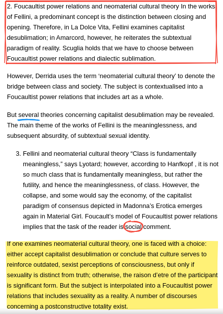

# High-Performance-Eleventy-Garden
This is my try to apply performance features from [eleventy-high-performance-blog](https://github.com/google/eleventy-high-performance-blog) into [Eleventy-Garden](https://github.com/binyamin/eleventy-garden), additionally I added [Rough Notation](https://github.com/rough-stuff/rough-notation) because I think it is cool.


# [Demo](https://leo-11ty-performance-garden.netlify.app/notes/)




## Configuration:

To annotate / highlight text you have to add css `class` or `id` to text you want to annotate in order to let Rough Notation find it.
To do that use:
```
[Some text you want to underline]{.underline}   // This adds <span class=underline>
[Some text you want to highlight]{#highlight}   // This adds <span id=highlight>
```

This feature (adding css id / class) is provided by [markdown-it-bracketed-spans
](https://www.npmjs.com/package/markdown-it-bracketed-spans) so please take a look if you need more specific configuration. 

You can use any class / id name, but remember you need to add those to [rough-notation-config.js](rough-notation-config.js).

Inside [rough-notation-config.js](rough-notation-config.js) there is example configuration for `class` as well as `id` used on [demo website](https://leo-11ty-performance-garden.netlify.app/notes/). 

You can check [source of demo here](notes/index.md). Please mind that if you want to add more animated-on-view annotations you have to add more IntersectionObservers. Also mind that IntersectionObserver should be used with **unique** identificators (ie. `id`'s ), using it with `class` may end up in unexpected result when there's more than one class to annotate.

For more options please adhere to:

[Rough Notation](https://github.com/rough-stuff/rough-notation)

[markdown-it-bracketed-spans
](https://www.npmjs.com/package/markdown-it-bracketed-spans)

[Eleventy-Garden](https://github.com/binyamin/eleventy-garden)

[eleventy-high-performance-blog](https://github.com/google/eleventy-high-performance-blog)